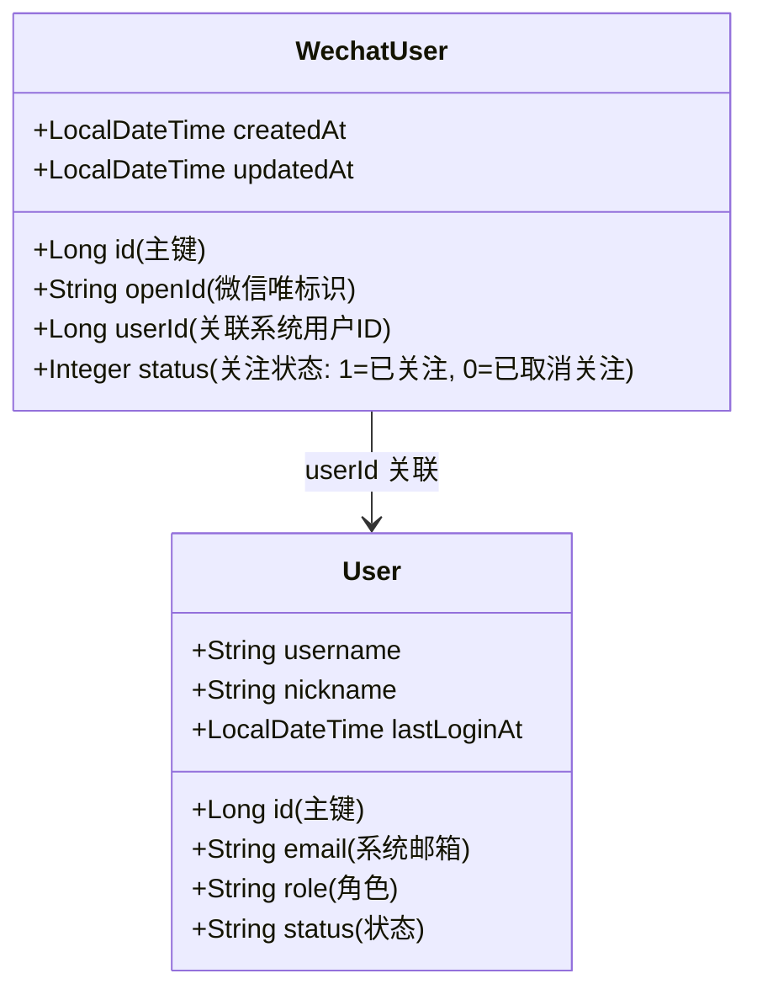

# 微信扫码登录与账号绑定系统全链路技术设计文档

本篇技术文档旨在全景式解析前台系统（Next.js）与后端服务（Spring Boot）、微信公众号平台（WeChat Server）以及数据存储层（PostgreSQL & Redis）之间的微信扫码登录与账号绑定逻辑。

---

## 🏗️ 一、 核心系统组件与职责划分

本系统采用经典的分层分体式架构，核心流转主要涉及以下五个节点：

```
+-------------+         +---------------+         +---------------+         +---------------+
|  1. 浏览器   |  WebSocket |  2. 后端服务  |   HTTP  |  3. 微信服务  |  推送   |  4. 用户微信  |
|   (Client)  | <=========> | (blog-service)| <=====> |    (WeChat)   | <=====> |    (App)      |
+-------------+             +---------------+         +---------------+         +---------------+
                                    ||                                                  
                                    || 访问 / 缓存                                      
                            +---------------+                                           
                            |  5. 数据库    |                                           
                            | (Redis / DB)  |                                           
                            +---------------+                                           
```

1.  **浏览器前端 (Client)**：渲染登录弹窗（[LoginModal.tsx](file:///Users/butvan/Butvan_Projets/my_code/Butvan%20Blog2.0/fronted/blog-client/src/components/auth/LoginModal.tsx)），发起获取二维码与凭证交换的 HTTP 请求，建立 WebSocket 长连接，维护扫码过程中的“等待、已扫码、登录中、已过期、异常”状态机。
2.  **微信开放平台 / 服务器 (WeChat)**：向微信客户端生成并分发二维码，接收用户的扫码关注或扫码登录指令，并将用户的动作包装为标准 XML 事件包实时转发给后端接口。
3.  **后端网关及业务服务 (blog-service)**：
    *   `WeiXinAuthLoginServiceImpl`：负责与微信平台建立 AccessToken 通信，获取临时 Ticket 二维码，托管上传至文件存储，并写入 Redis 初始会话。
    *   `WeiXinEventServiceImpl`：充当微信回调事件总控制器（微信消息路由器），处理关注 (`subscribe`)、扫码 (`SCAN`)、文本 (`text`) 和取消关注 (`unsubscribe`) 等事件。
4.  **Redis 缓存**：主要用于临时会话与安全凭证的管理，包括 Ticket 与 WebSocket 连接的绑定、首次注册微信用户的 openId 缓存、一次性安全登录交换码。
5.  **PostgreSQL 关系型数据库**：持久化微信用户绑定关系。

---

## 🗄️ 二、 数据库实体模型设计

数据库设计建立在 `WechatUser`（微信映射表）与 `User`（系统主用户表）的一对一（或多对一）映射基础之上：



### 1. 微信映射实体 ([WechatUser.java](file:///Users/butvan/Butvan_Projets/my_code/Butvan%20Blog2.0/backend/blog-pojo/src/main/java/com/butvan/blog/pojo/entity/WechatUser.java))
*   `openId` (VARCHAR(64)): 微信公众号用户的唯一标识，设置唯一约束。
*   `userId` (BIGINT): 系统核心账户的 `id`，绑定微信后不再为 `null`。
*   `status` (INT): 关注状态。`1` 代表已关注，`0` 代表已取消关注。

### 2. 系统核心用户实体 ([User.java](file:///Users/butvan/Butvan_Projets/my_code/Butvan%20Blog2.0/backend/blog-pojo/src/main/java/com/butvan/blog/pojo/entity/User.java))
*   系统通过微信登录时，使用邮箱 `email` 来识别、创建和关联系统账号。

---

## ⚡ 三、 Redis 缓存方案与键值设计

为保证系统的高并发表现以及一次性安全凭证效力，Redis 在其中承担了核心的状态转接功能：

| Redis 键值模式 (Key Pattern) | 数据类型 (Type) | 缓存值 (Value) | 有效期 (TTL) | 用途描述 |
| :--- | :--- | :--- | :--- | :--- |
| `wechat:qrcode:ticket:<ticket>` | String | `ws_id` (UUID) | 120秒 | 微信推送扫码事件时，通过 `ticket` 在 Redis 中反向查找关联的前端 WebSocket 连接。 |
| `wechat:register:openid:<openId>` | String | `ticket` | 120秒 | 针对首次关注需要发送邮箱绑定的用户，在 Redis 中做临时的 openId ➔ ticket 绑定映射。 |
| `wechat:exchange:code:<code>` | String | `userId` | 60秒 | 后端签发的一次性登录交换凭证，防止在网络信道中直接暴露 Session，60秒失效且使用即被删除。 |

---

## 🔄 四、 全链路四阶段剖析与逻辑细节

```
【 阶段一：建立 WS 与二维码获取 】
 客户端  --- getWechatQRCode() ---> 后端 --- 获取AccessToken/Ticket ---> Redis 缓存
 客户端  <==== 建立 WebSocket ===== 后端 (基于随机生成的 ws_id)
 
【 阶段二：用户扫码与微信事件推送 】
 用户微信  ==== 扫描二维码 ====>> 微信平台 ---- 回调推送事件 (XML) ----> 后端 (WeiXinEventServiceImpl)
                                                                             || 查 Redis 获取 ws_id
 客户端  <==== WebSocket 实时通知 "已扫码" ================================== 后端

【 阶段三：首次关注绑定 (subscribe) 与已关注直接登录 (SCAN) 】
 [分支 A: 已关注 SCAN]
 后端 ➔ 检查 WechatUser 与系统账号 ➔ 存在 ➔ 生成交换码 ➔ WS 登录成功 ➔ 客户端 HTTP 交换 Token
 
 [分支 B: 未关注 subscribe]
 后端 ➔ 校验 20 限制 ➔ 发送模板消息引导发送邮箱 ➔ 客户端显示“请发送邮箱”提示

【 阶段四：微信内回复邮箱绑定完成登录 (text 事件) 】
 用户在微信输入框发送 'example@mail.com' ➔ 微信转发给后端 ➔ 后端校验邮箱 ➔ 关联/创建系统 User ➔ WS 登录成功
```

### 阶段一：连接建立与二维码签发
1.  用户打开登录页面，前端组件调用 `fetchWechatQR()` 方法，向后端发起 HTTP GET 请求：`/api/auth/qrcode`（对应 [WeiXinAuthLoginServiceImpl.java](file:///Users/butvan/Butvan_Projets/my_code/Butvan%20Blog2.0/backend/blog-service/src/main/java/com/butvan/blog/service/weixin/service/impl/WeiXinAuthLoginServiceImpl.java#L36)）。
2.  后端服务：
    *   首先通过 `wechatUserRepository.countByStatus(1)` 确认当前已关注总人数，若 `>= 20` 人则抛出名额已满异常。
    *   请求微信平台 API 换取 `qrCodeTicket`，并拉取二维码字节流上传到本地 / 阿里云 / MinIO，获取公开的 `qrUrl`。
    *   生成随机唯一的 `wsId` (UUID)。
    *   在 Redis 写入 `wechat:qrcode:ticket:<ticket> ➔ wsId`，有效期 120 秒。
    *   将 `qrUrl` 和 `wsId` 作为响应体返回前端。
3.  前端拿到数据，页面渲染二维码，并调用 `wsConnect(wsId)` **建立 WebSocket 长连接**，开启 110 秒防死锁倒计时。

---

### 阶段二：用户扫码与服务器端事件分流
1.  用户拿起手机，扫描网页上的二维码：
    *   如果用户**此前没有关注过**公众号：微信推送 `subscribe` 事件（带二维码 `ticket` 参数）。
    *   如果用户**此前已经关注了**公众号：微信推送 `SCAN` 事件（带二维码 `ticket` 参数）。
2.  后端统一的 XML 事件推送总入口（`/api/weixin` ➔ `weiXinServerPost`）捕获请求，解析出 XML 包中的 `ticket` 和 `open_id`。
3.  后端统一提取 Redis 中的 `ticket`：
    ```java
    String redis_key = WeiXinRedisKeyPrefix.REDIS_QRCODE_TICKET_WS_ID_KEY + ticket;
    String ws_id = redisUtils.get(redis_key);
    ```
4.  若 `ws_id` 存在，后端调用 `webSocketServer.sendMessage(ws_id)` 发送一条“**二维码被扫描**”的 WebSocket 消息，前端捕获后清除倒计时，并将状态切换为 `scanned`（已扫码）。

---

### 阶段三：后端分支流转校验与处置

#### 分支 A：用户已关注扫码分支 (`userLogin`)
在 [WeiXinEventServiceImpl.java:L288-325](file:///Users/butvan/Butvan_Projets/my_code/Butvan%20Blog2.0/backend/blog-service/src/main/java/com/butvan/blog/service/weixin/service/impl/WeiXinEventServiceImpl.java#L288-L325) 中：
1.  后端根据 `open_id` 检索 `WechatUser` 实体。
2.  如果该用户未绑定系统主账户（`wechatUser.getUserId() == null`），直接抛出异常，要求用户通过关注进行首次绑定注册。
3.  若已绑定系统用户，后端会校验系统中的 `User` 的邮箱数据是否异常。若正常，会更新最后登录时间。
4.  **生成交换码并下发**：
    *   生成一次性 UUID 作为交换码 `exchangeCode`，写入 Redis：`wechat:exchange:code:<exchangeCode> ➔ userId`，失效时间为 60 秒。
    *   通过 WebSocket 发送消息告知前端登录成功，附带 `exchangeCode`。
    *   微信发送登录成功的模版消息给用户手机。

#### 分支 B：用户未关注扫码分支 (`userFirstRegister`)
在 [WeiXinEventServiceImpl.java:L230-282](file:///Users/butvan/Butvan_Projets/my_code/Butvan%20Blog2.0/backend/blog-service/src/main/java/com/butvan/blog/service/weixin/service/impl/WeiXinEventServiceImpl.java#L230-L282) 中：
1.  **名额防漏校验**：查询当前已关注的总用户数，限制系统在 20 名额上限内。
2.  **二次关注恢复处理**：如果发现 `WechatUser` 在库中存在且 status 为 `0`（曾经取关过）且绑定过系统 `userId`：
    *   直接将该用户的 status 字段更新恢复为 `1`。
    *   生成交换码 `exchangeCode`，通过 WebSocket 推送至前端，完成一键登录，不需要重新绑定邮箱。
3.  **全新关注绑定引导**：
    *   如果是一个从未在系统中有过记录的全新微信 openId，在 Redis 存入 `wechat:register:openid:<openId> ➔ ticket`。
    *   调用模板消息接口给用户手机发送引导文案：*“请您在公众号中回复您的邮箱地址以完成账号注册与绑定。”*

---

### 阶段四：用户回复邮箱完成绑定注册 (`userText` 文本事件)
在 [WeiXinEventServiceImpl.java:L129-224](file:///Users/butvan/Butvan_Projets/my_code/Butvan%20Blog2.0/backend/blog-service/src/main/java/com/butvan/blog/service/weixin/service/impl/WeiXinEventServiceImpl.java#L129-L224) 中：
1.  微信用户在手机公众号输入框输入邮箱并发言。微信服务器推送 `text` 事件至后端。
2.  后端 `userText` 方法拦截到内容，首先运行 `EmailUtils.extractEmail(content)` 提取邮箱地址并进行格式正则验证。不合法则打印日志不予处理。
3.  后端根据当前会话的 `openId` 反向在 Redis 查找 `ticket`，再根据 `ticket` 获取浏览器端对应的 WebSocket `ws_id`。
4.  检查系统 `User` 表中是否已经存在该邮箱对应的用户：
    *   **情况一：系统用户不存在（全新注册）**
        1.  创建系统 `User` 记录，角色设为 `USER`。
        2.  新建或更新 `WechatUser`，将 `userId` 关联指向新创建 of `User.id` 并保存。
        3.  微信发送注册成功模板消息。
        4.  后端生成交换码 `exchangeCode`，通过 WebSocket 下发通知前端“注册成功”并完成登录。
    *   **情况二：系统用户已存在（老账号绑定微信）**
        1.  将当前 `WechatUser` 的 `userId` 更新关联为已有的 `User.id`。
        2.  微信发送绑定成功通知。
        3.  若此用户是通过二维码扫码触发的动作，生成交换码并下发，WS 通知浏览器登录成功。

---

## 🔒 五、 安全设计要点：凭证安全交换机制 (Token Exchange)

在 WebSocket 实时通道中传输包含极高权限的正式授权凭证（如 JWT 或者是会话 Cookie）存在较大的信道嗅探与劫持风险。为此系统引入了**防劫持凭证安全交换机制**：

1.  **WebSocket 仅负责推送无状态的通知和一次性随机凭证**：
    *   当登录就绪时，后端在内存/Redis 中缓存 `wechat:exchange:code:<uuid> ➔ userId`，并把这个 `exchangeCode` 推送给前端。
2.  **前端二次安全兑换**：
    *   前端收到交换码后，发起安全的 HTTPS HTTP Post 请求 `/api/auth/wechat/exchange`（对应 [AuthController.java:L311-328](file:///Users/butvan/Butvan_Projets/my_code/Butvan%20Blog2.0/backend/blog-service/src/main/java/com/butvan/blog/service/controller/AuthController.java#L311-L328)），入参只包含这个一次性 `code`。
3.  **一次性核销与双 Cookie 下发**：
    *   后端接收到请求后，通过 Redis 取得 `userId`，**并立刻删除该 Key**，杜绝二次使用（防止重放攻击）。
    *   后端基于 TokenService 为该用户签发双 Token：`access_token`（有效期 900 秒）与 `refresh_token`（有效期 7 天）。
    *   设置 **`httpOnly(true)`、`secure(true)`、`sameSite("Lax")`** 安全属性后，以 Set-Cookie 首部返回前端。
    *   浏览器将 Cookie 自动储存在安全沙箱中，从此在进行任何数据访问时自动携带 Cookie，彻底免疫 XSS 脚本截获攻击。
